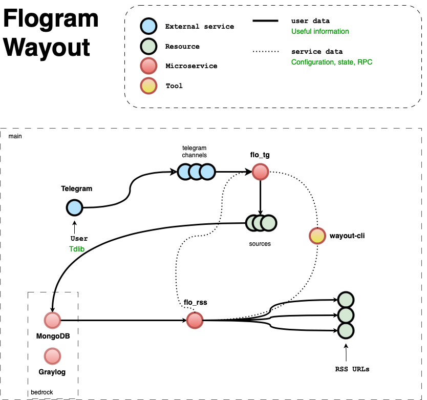

# Wayout

Read Telegram Messenger content with simple RPC API/RSS.

# Installation

      $ docker network create --driver bridge flogram-internal

      $ docker-compose --profile bedrock up -d

Before running Wayout, I had to:

 1. Preflight initialize graylog and provision certificate to the datanode using the web browser UI. The password for Basic Auth was printend in container log.

 2. Add **GELF TCP** source in **System > Inputs** with default port. This allows services to log messages to Graylog, which is important for error and problem tracing.

 **It is important to ensure that phone number is authorized by running flo_tg in interactive mode:**

      $ docker-compose run -it flo_tg

### Blueprint

## Configuration

I copied `.env.example` as `.env` to create configuration.

 - Wayout uses tdlib to act as a console Telegram client (flo_tg)
 
 I've [created my Telegram App](https://core.telegram.org/api/obtaining_api_id) and saved APP_ tokens given by Telegram to the `.env` file.

 - Wayout itself is compiled from source with command:

      $ docker-compose --profile main build

## Run

 - When I change `TG_PHONE` authorization in Telegram in interactive shell was required.

      $ docker-compose run -it flo_tg

When it did not ask to enter SMS code, I am ready to go in non-interactive (normal) mode:

      $ docker-compose --profile main up -d

-----

### CLI

flo_tg

      $ wayout conf

      $ wayout sources
      $ wayout sources --monitored

      $ wayout source --on 3773432
      $ wayout source --stream 3773432
      $ wayout source --off 3773432

flo_rss

      $ wayout rss

      $ wayout rss --url 3773432
      $ wayout rss --add 3773432
      $ wayout rss --rm 3773432

If monitoring was not turned on for a source, new messages are not saved/streamed.

### Connectivity

Basic `docker-compose.yml` only exposes TCP/UDP ports of Graylog and its Datanode to host.

Containers linked to the `flogram-internal` bridged network can reach each other.

### Development

***Devcontainers** extension must be used to edit, test, debug code in **Visual Studio Code** editor.

#### Extending

To programmaticaly receive messages saved in monitored sources, a gRPC client could be written.

[flogram-lab/lazyr](https://github.com/flogram-lab/lazyr) is an example in Swift.

 `github.com/flogram-lab/wayout/flo_tg/proto` is to be imported in Go programs.

#### Compile gRPC changes

Compiling protobuf files and updating go/swift sources is done inside docker. Simply:

      $ docker-compose --profile protoc up
